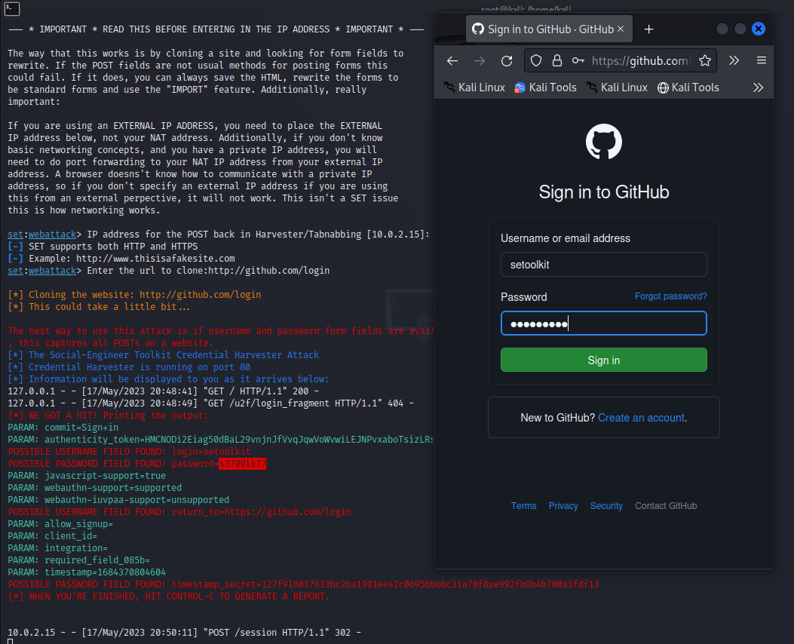

# dio-phishing

Desafio de projeto para a trilha Cybersecurity Specialist da DIO.

## Processo

- Instalação de uma máquina virtual com Kali Linux
- Geração de um clone da página de login do GitHub com o SETOOLKIT
- Opções da seleção:
  - (1) `Social-Engineering Attacks`
  - (2) `Website Attack Vectors`
  - (3) `Credential Harvester Attack Method`

O SETOOLKIT cria uma página de login idêntica à do GitHub, captura todas as requisições POST e as mostra na saída do terminal.
